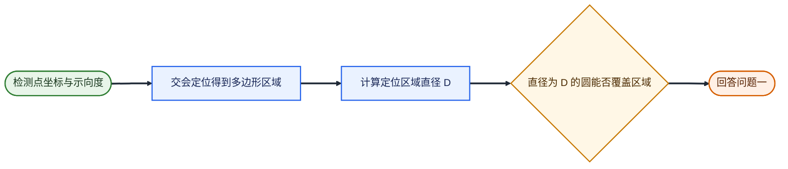

# 问题 1 主要思想图

该图只保留问题一的建模思想与判断目标，不展开具体几何算法。

```mermaid
%%{init: {"theme": "base", "themeVariables": {"background": "#ffffff", "lineColor": "#1f2937", "textColor": "#17212b", "fontFamily": "Noto Sans CJK SC, Arial, sans-serif"}, "flowchart": {"curve": "basis", "nodeSpacing": 55, "rankSpacing": 65}}}%%
flowchart LR
    start([检测点坐标与示向度]) --> region[交会定位得到多边形区域]
    region --> diameter[计算定位区域直径 D]
    diameter --> cover{直径为 D 的圆能否覆盖区域}
    cover --> output([回答问题一])
    classDef startNode fill:#e8f5e9,stroke:#2e7d32,color:#16351b,stroke-width:1.8px;
    classDef processNode fill:#eaf2ff,stroke:#2563eb,color:#172554,stroke-width:1.8px;
    classDef decisionNode fill:#fff7e6,stroke:#c77700,color:#4a2a00,stroke-width:1.8px;
    classDef terminalNode fill:#fff0e6,stroke:#d55e00,color:#562100,stroke-width:1.8px;
    class start startNode;
    class region,diameter processNode;
    class cover decisionNode;
    class output terminalNode;
    linkStyle default stroke:#1f2937,stroke-width:2.8px;
```
