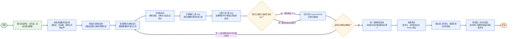

# 问题 2 第二检测点选择主流程图

该版本按更新后的实现展示：候选点由多层粗到细搜索逐步生成，并补充解析基线、对称点和安全边界点；随后分别计算解析上界 A 与几何上界 B，合并为 C=min(A,B)，再迭代细化并筛选结果。

```mermaid
%%{init: {"theme": "base", "themeVariables": {"background": "#ffffff", "lineColor": "#1f2937", "textColor": "#17212b", "fontFamily": "Noto Sans CJK SC, Arial, sans-serif"}, "flowchart": {"curve": "basis", "nodeSpacing": 45, "rankSpacing": 55}}}%%
flowchart LR
    start([开始]) --> input["输入首站坐标、示向度、误差与移动预算"]
    input --> prior["构造首读数外包区域<br/>首扇区、目标圆、距离与有效边界"]
    prior --> safe["构造安全收信区域<br/>四圆盘交集与移动预算约束"]
    safe --> search["多层搜索生成候选点<br/>粗到细搜索半径与方位"]
    search --> augment["补充候选点<br/>解析基线、对称点与安全边界点"]
    augment --> analytic["计算解析上界 A(q)<br/>连续读数的保守直径上界"]
    analytic --> geometric["计算几何上界 B(q)<br/>读数网格半步增宽后的区域直径"]
    geometric --> early{"部分扫描最大值是否达到 A(q)？"}
    early -->|是：提前确定 C=A| combine["合并评分 C(q)=min(A,B)<br/>记录扫描状态"]
    early -->|否：继续扫描至完整 B| combine
    combine --> refine{"是否完成预设搜索层？"}
    refine -->|否：以当前最优点为中心缩小步长| search
    refine -->|是| final["统一最终精度复核<br/>对全部已访问候选重新计算 C"]
    final --> select["结果筛选<br/>最优点、近优最快点与 Pareto 前沿"]
    select --> output["输出第二检测点、候选区域与时间指标"]
    output --> posterior["获得第二次示向度后<br/>按共用几何模型构造后验区域外包"]
    posterior --> finish([结束])
    classDef startNode fill:#e8f5e9,stroke:#2e7d32,color:#16351b,stroke-width:1.5px;
    classDef processNode fill:#eaf2ff,stroke:#2563eb,color:#172554,stroke-width:1.5px;
    classDef decisionNode fill:#fff7e6,stroke:#c77700,color:#4a2a00,stroke-width:1.5px;
    classDef terminalNode fill:#fff0e6,stroke:#d55e00,color:#562100,stroke-width:1.5px;
    class start,input startNode;
    class prior,safe,search,augment,analytic,geometric,combine,final,select,output,posterior processNode;
    class early,refine decisionNode;
    class finish terminalNode;
    linkStyle default stroke:#1f2937,stroke-width:2.5px;
```
