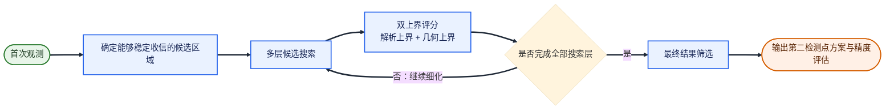

# 问题 2 主要思想图

该图只保留问题二“选择第二检测点以缩小定位不确定性”的核心思路，不展开具体评分与搜索方法。

```mermaid
%%{init: {"theme": "base", "themeVariables": {"background": "#ffffff", "lineColor": "#1f2937", "textColor": "#17212b", "fontFamily": "Noto Sans CJK SC, Arial, sans-serif"}, "flowchart": {"curve": "basis", "nodeSpacing": 55, "rankSpacing": 65}}}%%
flowchart LR
    start([首次观测]) --> region[确定能够稳定收信的候选区域]
    region --> search[多层候选搜索]
    search --> score["双上界评分<br/>解析上界 + 几何上界"]
    score --> refine{是否完成全部搜索层}
    refine -->|否：继续细化| search
    refine -->|是| select[最终结果筛选]
    select --> output([输出第二检测点方案与精度评估])
    classDef startNode fill:#e8f5e9,stroke:#2e7d32,color:#16351b,stroke-width:1.8px;
    classDef processNode fill:#eaf2ff,stroke:#2563eb,color:#172554,stroke-width:1.8px;
    classDef terminalNode fill:#fff0e6,stroke:#d55e00,color:#562100,stroke-width:1.8px;
    class start startNode;
    class region,search,score,select processNode;
    class refine decisionNode;
    class output terminalNode;
    linkStyle default stroke:#1f2937,stroke-width:2.8px;
```
