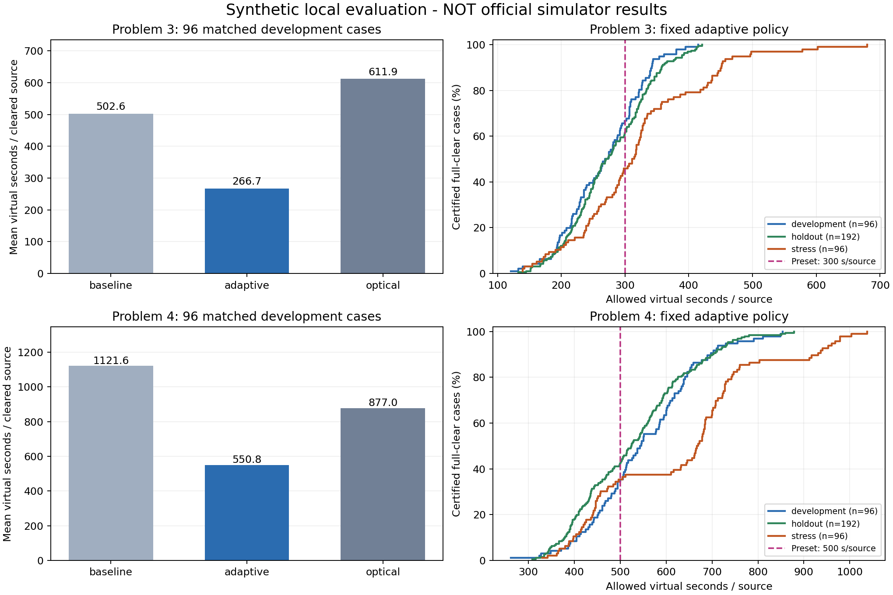

# 问题三、四：本地实验与证据边界

**第四问已完成第二轮速度改进，最新结果见 [新版与上一版配对比较](../problem4/results/speed_comparison_v2.md)。** 第二轮使用额外384/512/256例，并在新留出测试前冻结代码。下面保留第一轮历史记录；其中第四问的 `adaptive` 现以 `legacy` 名称保留，不代表当前默认版本。

本实验使用自行构造的物理环境和案例，没有读取官方模拟器数据，也没有消耗正式测试机会。算法通过只暴露检测与清除响应的客户端运行，不能读取实际源数、坐标、半径或朝向；评分器只在运行结束后读取真值。

## 最终结果

总计 **768 个不同案例、1152 次策略运行**：每问96例开发集比较3个分支，再各用192例留出集和96例压力集检验冻结的默认分支。全部运行均完成清除与完成确认，无失败案例被剔除。

| 问题与集合 | 全清且完成确认 | 平均每源虚拟秒 | 自定阈值通过率 | 总时间P95/秒 | 最差总时间/秒 |
| --- | --- | --- | --- | --- | --- |
| 第三问开发 | 96/96 | 266.73 | 66.7% | 4705.1 | 4911.7 |
| 第三问留出 | 192/192 | 275.99 | 61.5% | 4896.0 | 5543.0 |
| 第三问压力 | 96/96 | 318.42 | 45.8% | 5783.7 | 10882.0 |
| 第四问开发 | 96/96 | 550.82 | 35.4% | 9896.3 | 10950.0 |
| 第四问留出 | 192/192 | 527.71 | 42.2% | 9837.3 | 11760.9 |
| 第四问压力 | 96/96 | 629.27 | 35.4% | 11327.1 | 11949.9 |

全清与过速度阈值是两件事。第四问仍有较多案例超过500秒/源，没有通过提高阈值掩盖这点。

| 开发集同例比较 | 基础分支/秒每源 | 优化分支/秒每源 | 光学分支/秒每源 | 优化相对基础减少 |
| --- | --- | --- | --- | --- |
| 第三问 | 502.57 | 266.73 | 611.88 | 46.9% |
| 第四问 | 1121.61 | 550.82 | 877.04 | 50.9% |

以上百分比比较开发集逐例平均时间的均值，代表整套策略的差别，不将多项同时改动的结果归因于某一个模块。



逐例与分场景明细：[第三问开发](../problem3/results/benchmark_development.md)、[留出](../problem3/results/benchmark_holdout.md)、[压力](../problem3/results/benchmark_stress.md)；[第四问开发](../problem4/results/benchmark_development.md)、[留出](../problem4/results/benchmark_holdout.md)、[压力](../problem4/results/benchmark_stress.md)。每份Markdown旁有完整JSON与代码指纹。768例输入已保存在两问的examples目录，可直接复现。

## 迭代与未采用的尝试

第三问先增加顺路交会，再把定位不确定性纳入目标调度，开发均值约329→285→267秒/源；额外在清除点全扫并动态删去冗余搜索点，新增检测开销抵消了路程收益，默认关闭。

第四问先把31点三角格覆盖压到有证明的25点布局，再用成对横向探测解决未知发射侧，主要消除了失信号后的光学盲搜；有限2-opt重排只带来小幅改善。上述过程只使用开发集。独立复核中，增加路径交换次数没有收益，减少顺路补测明显变差，改变探测轮数也未优于5轮，因此不继续围绕这些参数微调。

另尝试“中心+6内环+12外环”的19点结构，外环半径1870米；解析反例否定了它，因此未为减少扫描点牺牲完整性：内环半径a>1000时，原点附近朝外源可能只有原点在接收半径内却在背面；a≤1000时，在相邻内环点角平分线上取半径868米的朝外源，所有内环点投影≤1000cos30°<868，全部在背面，而所有外环点距源至少1870−868=1002>1000。

## 事先固定的比较方法

每问分别设开发集 96 例、留出集 192 例、压力集 96 例。三个集合的随机种子区间不同，第三、四问也不同。生成规则在 `problem3/scenarios.py`；所有分支使用相同案例、同地点固定误差和相同计时规则。

八类场景：均匀分布、多个密集簇、圆边界分布、边界向外辐射、近共线长走廊、近邻成对源、接收/近距离临界点、最短接收半径。每类还改变源数、频道、整体旋转和误差场。压力集强调 1000 米接收半径、±1°极端或持久偏差、10/16个源，并让第四问绝大多数源为定向。

误差模式包括按位置固定的伪随机误差、平滑空间误差、端点±1°误差和按频道持久偏差；回包再四舍五入到两位小数。以上是对题设允许情况的自建压力分布，不假定它等于官方生成器。

优先级为：不漏清并取得完成确认，然后提高速度阈值通过率，再减少平均/尾部虚拟耗时。第三问阈值300秒/源，第四问500秒/源，均在最终留出测试前固定。奖励先对未全清/未确认给予至少一百万负分，过阈值加1000，再按时间余量加分。题目未规定此奖励。

## 统计口径

- 清除比例 = 清除数 / 实际源数。
- 平均定位清除时间 = 最终总虚拟时间 / 清除数；分母为0时无定义。
- 完成任务时间计入最后一次清除后的剩余覆盖确认，避免通过提前退出获得虚假提速。
- `completion_certified` 表示通过全覆盖或清除16个完成确认；`coverage_complete` 只表示检测点覆盖本身已完成。
- 另报阈值通过率、P95与最差总时间、移动距离、动作数、失败光学尝试、90%清除时刻和本地程序运行时间。
- 本地运行耗时不含官方HTTP、日志处理和平台延迟；正式成绩以平台界面与原名加密日志为准。

## 参考技巧

测向几何同时受距离和交角影响，不能只追求90°交会而忽略行走成本；本文只借鉴此原则，保证依然来自有界误差集合，而非高斯误差下的统计下界。[Bishop等，Optimality Analysis of Sensor-Target Localization Geometries](https://www.csc.kth.se/~adrianb/docs/bishopGeometry2008.pdf)

有限覆盖负责不漏，路径排序负责成本；这种拆分与经典完整覆盖规划的思路一致。本项目并未实现文献的完整牛耕单元分解。[Choset与Pignon，Coverage Path Planning: The Boustrophedon Decomposition](https://publications.ri.cmu.edu/coverage-path-planning-the-boustrophedon-decomposition)

## 复现

```powershell
python scripts/benchmark_search.py --problem 3 --split development --strategies baseline adaptive optical --tag v1_reproduction --save-cases
python scripts/benchmark_search.py --problem 4 --split development --strategies baseline legacy optical --tag v1_reproduction --save-cases
python scripts/benchmark_search.py --problem 3 --split holdout --strategies adaptive --tag v1_reproduction --save-cases
python scripts/benchmark_search.py --problem 4 --split holdout --strategies legacy --tag v1_reproduction --save-cases
python scripts/benchmark_search.py --problem 3 --split stress --strategies adaptive --tag v1_reproduction --save-cases
python scripts/benchmark_search.py --problem 4 --split stress --strategies legacy --tag v1_reproduction --save-cases
```

报告保存全部种子、逐例结果、失败记录、参数和代码SHA-256。运行期间代码改变则拒绝生成混合版本报告。后续若根据留出结果调整算法，须另建新留出种子，不能继续称原集合为未见数据。

插图可用 `python scripts/plot_search.py` 重建；仅此可选绘图脚本需要matplotlib，核心求解和验证不需要。本地用时含本机进程调度影响，不应将毫秒级差别解释为平台速度收益。
